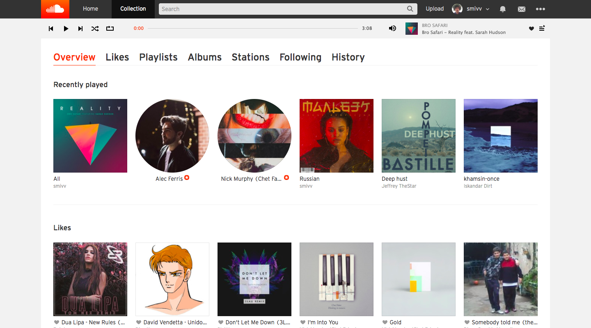

# Sound Cloud controls customization

### Installing

What you need to do

- Install Tamper Monkey script manager for chrome/mozilla/etc.
- Clone script

```
git clone https://github.com/smivv/sound-cloud-controls-up
```

- Put that script to yout scripts manager
- ?????
- Enjoy!

## Result screenshot



## Built With

* [Javascript](http://javascript.ru/) - The web language used

## Authors

* **Vladimir Smirnov** - *Initial work* - [smivv](https://github.com/smivv)